---
## Front matter
lang: ru-RU
title: Лабораторная работа №2
subtitle: Задача о погоне
author:
  - Бабенко Артём Сергеевич
institute:
  - Российский университет дружбы народов, Москва, Россия
  
date: 16.02.2024

## Formatting pdf
toc: false
toc-title: Содержание
slide_level: 2
aspectratio: 169
section-titles: true
theme: metropolis
header-includes:
 - \metroset{progressbar=frametitle,sectionpage=progressbar,numbering=fraction}
 - '\makeatletter'
 - '\beamer@ignorenonframefalse'
 - '\makeatother'
---

# Цель работы

- Научиться решать задачи поиска с помощью построения математических моделей для выбора правильной стратегии.

# Задание

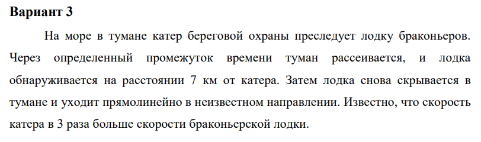

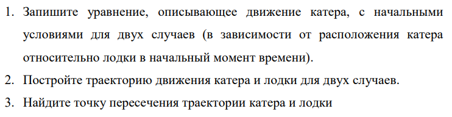

# Теоретическое введение

## Julia — это открытый свободный высокопроизводительный динамический язык высокого уровня, созданный специально для технических (математических) вычислений.

## Его синтаксис близок к синтаксису других сред технических вычислений, таких как Matlab и Octave. Он имеет в своём составе сложный компилятор, обеспечивает распределённое параллельное выполнение инструкций, вычислительную точность и обширную библиотеку математических функций.

## Возможности языка:
множественная диспетчеризация (мультиметод): обеспечение возможности определять поведение функции при различных комбинациях типов аргументов;
динамическая типизация;
хорошая производительность, приближающаяся к производительности статических языков;
встроенный менеджер пакетов;
макросы и другие объекты метапрограммирования;
функции обработки вызовов Python: пакет PyCall;
функции прямой обработки вызовов C без надстроек;
мощные возможности оболочки для управления другими процессами;
возможности обеспечения параллелизма и распределённых вычислений;
эффективная поддержка кодировки Unicode.
Язык Julia распространяется бесплатно вместе с исходными кодами.

# Ход работы

## Первый способ

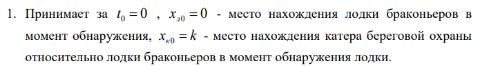 k = 7 (км)

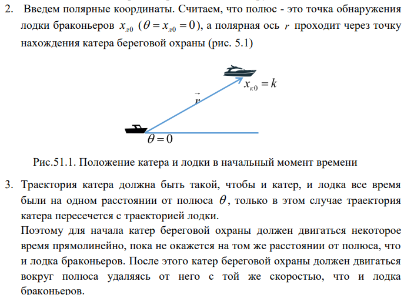

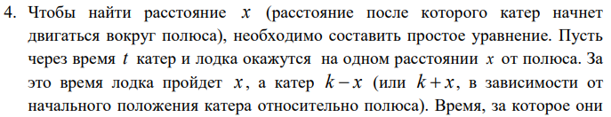
Время, за которое они пройдут это расстояние, вычисляется как х/v или (k-x)/3v , во втором случае (х+k)/3v. Так как время одно и то же, то эти величины одинаковы.
Тогда неизвестное расстояние х можно найти из следующего уравнения:

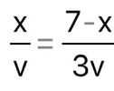 в первом случае или

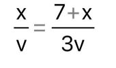 во втором.

Отсюда мы найдем два значения х = 7/4, x = 7/2, задачу будем решать для двух случаев.

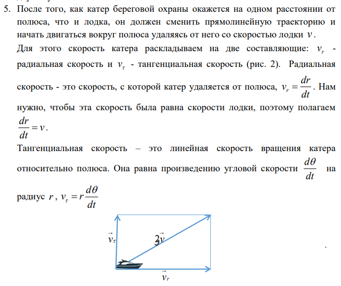

Из рисунка видно:  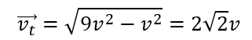
(учитывая, что радиальная скорость равна v). Тогда получаем: 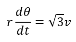

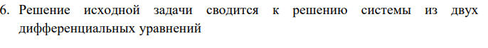

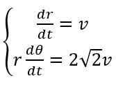 

с начальными условиями 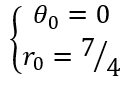 или 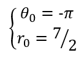

Исключая из полученной системы производную по t, переходим к следующему уравнению: 

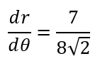 в первом случае и 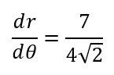 во втором.

Начальные условия остаются прежними. Решив эти уравнения, мы получим траекторию движения катера в полярных координатах.

## Второй способ

Код на Julia:

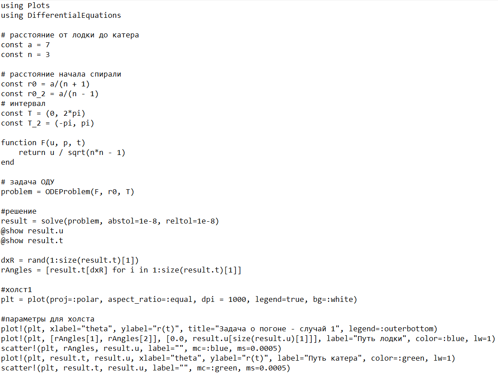
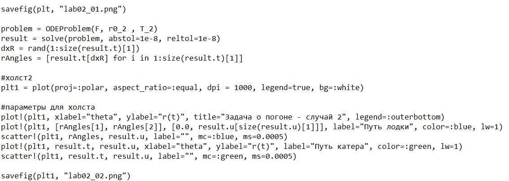

Запуск файла с кодом:

Результат: траектории движения лодки и катера для двух случаев. 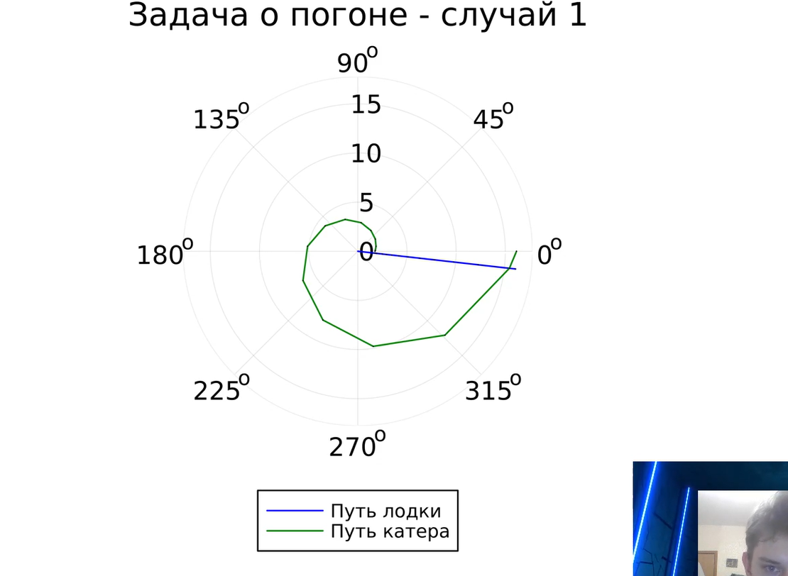 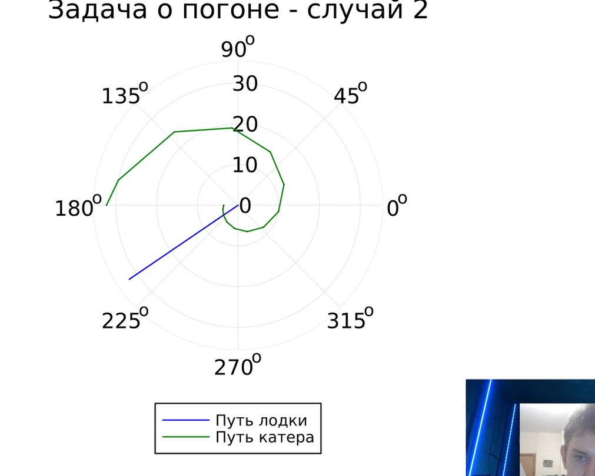 
По полученным изображениям вычислил точку пересечения катера и лодки.

# Выводы

Я ознакомился с языком Julia, его синтаксисом и научился решать задачи поиска с помощью построения математических моделей для выбора правильной стратегии.

