---
## Front matter
title: "Лабораторная работа 2"
subtitle: "Задача о погоне"
author: "Бабенко Артём Сергеевич"

## Generic otions
lang: ru-RU
toc-title: "Содержание"

## Bibliography
bibliography: bib/cite.bib
csl: pandoc/csl/gost-r-7-0-5-2008-numeric.csl

## Pdf output format
toc: true # Table of contents
toc-depth: 2
lof: true # List of figures
lot: true # List of tables
fontsize: 12pt
linestretch: 1.5
papersize: a4
documentclass: scrreprt
## I18n polyglossia
polyglossia-lang:
  name: russian
  options:
	- spelling=modern
	- babelshorthands=true
polyglossia-otherlangs:
  name: english
## I18n babel
babel-lang: russian
babel-otherlangs: english
## Fonts
mainfont: PT Serif
romanfont: PT Serif
sansfont: PT Sans
monofont: PT Mono
mainfontoptions: Ligatures=TeX
romanfontoptions: Ligatures=TeX
sansfontoptions: Ligatures=TeX,Scale=MatchLowercase
monofontoptions: Scale=MatchLowercase,Scale=0.9
## Biblatex
biblatex: true
biblio-style: "gost-numeric"
biblatexoptions:
  - parentracker=true
  - backend=biber
  - hyperref=auto
  - language=auto
  - autolang=other*
  - citestyle=gost-numeric
## Pandoc-crossref LaTeX customization
figureTitle: "Рис."
tableTitle: "Таблица"
listingTitle: "Листинг"
lofTitle: "Список иллюстраций"
lotTitle: "Список таблиц"
lolTitle: "Листинги"
## Misc options
indent: true
header-includes:
  - \usepackage{indentfirst}
  - \usepackage{float} # keep figures where there are in the text
  - \floatplacement{figure}{H} # keep figures where there are in the text
---

# Цель работы

Научиться решать задачи поиска с помощью построения математических моделей для выбора правильной стратегии.

# Теоретическое введение

Julia — это открытый свободный высокопроизводительный динамический язык высокого уровня, созданный специально для технических (математических) вычислений.

Его синтаксис близок к синтаксису других сред технических вычислений, таких как Matlab и Octave. Он имеет в своём составе сложный компилятор, обеспечивает распределённое параллельное выполнение инструкций, вычислительную точность и обширную библиотеку математических функций.

Возможности языка:

множественная диспетчеризация (мультиметод): обеспечение возможности определять поведение функции при различных комбинациях типов аргументов;
динамическая типизация;
хорошая производительность, приближающаяся к производительности статических языков;
встроенный менеджер пакетов;
макросы и другие объекты метапрограммирования;
функции обработки вызовов Python: пакет PyCall;
функции прямой обработки вызовов C без надстроек;
мощные возможности оболочки для управления другими процессами;
возможности обеспечения параллелизма и распределённых вычислений;
эффективная поддержка кодировки Unicode.
Язык Julia распространяется бесплатно вместе с исходными кодами.

# Выполнение лабораторной работы

С помощью предоставленной формулы рассчитал свой вариант:
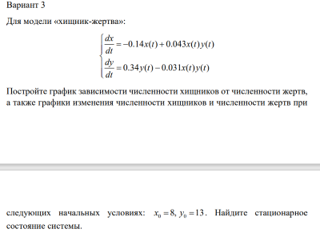

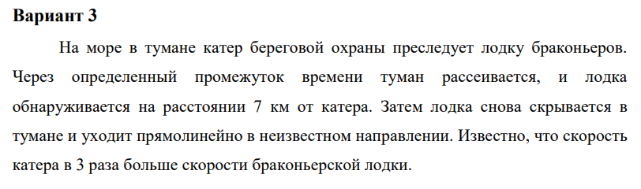

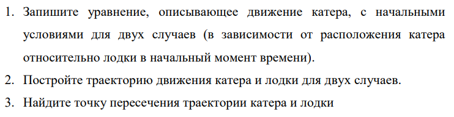

Решение:
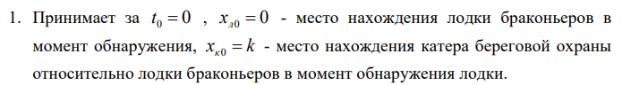 k = 7 (км)

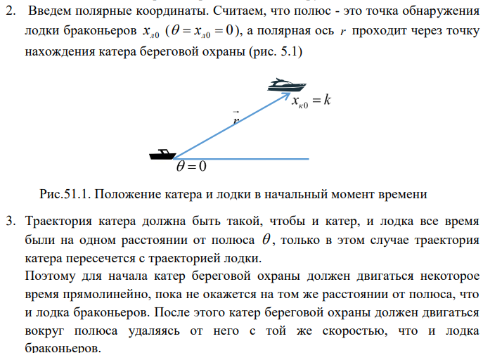

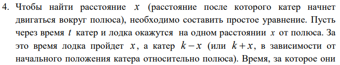
Время, за которое они пройдут это расстояние, вычисляется как х/v или (k-x)/3v , во втором случае (х+k)/3v. Так как время одно и то же, то эти величины одинаковы.
Тогда неизвестное расстояние х можно найти из следующего уравнения:

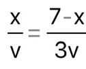 в первом случае или

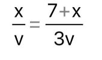 во втором.

Отсюда мы найдем два значения х = 7/4, x = 7/2, задачу будем решать для двух случаев.

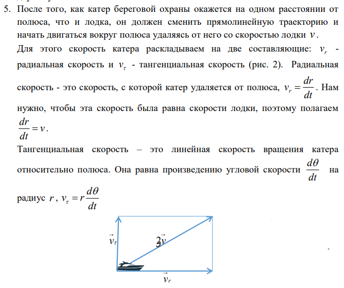

Из рисунка видно:  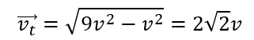
(учитывая, что радиальная скорость равна v). Тогда получаем: 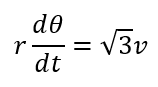

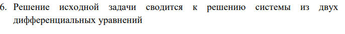

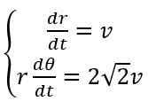 

с начальными условиями 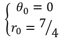 или 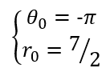

Исключая из полученной системы производную по t, переходим к следующему уравнению: 

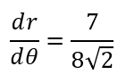 в первом случае и 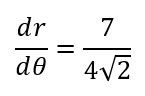 во втором.

Начальные условия остаются прежними. Решив эти уравнения, мы получим траекторию движения катера в полярных координатах.

Затем я решил эту задачу другим способом - написал код на Julia:

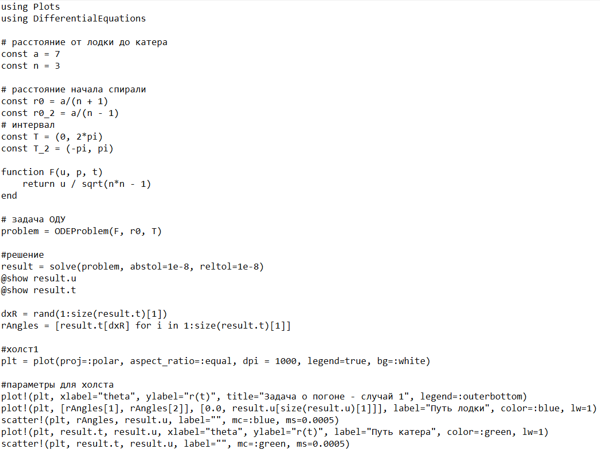

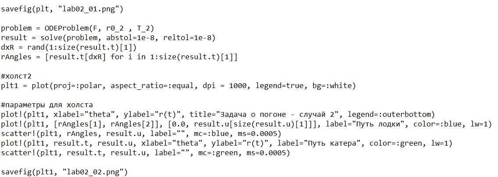

Через Windows Powershell запустил файл с кодом:

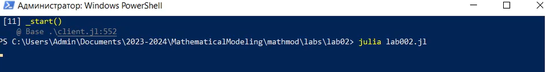

И получил следующий результат: траектории движения лодки и катера для двух случаев. 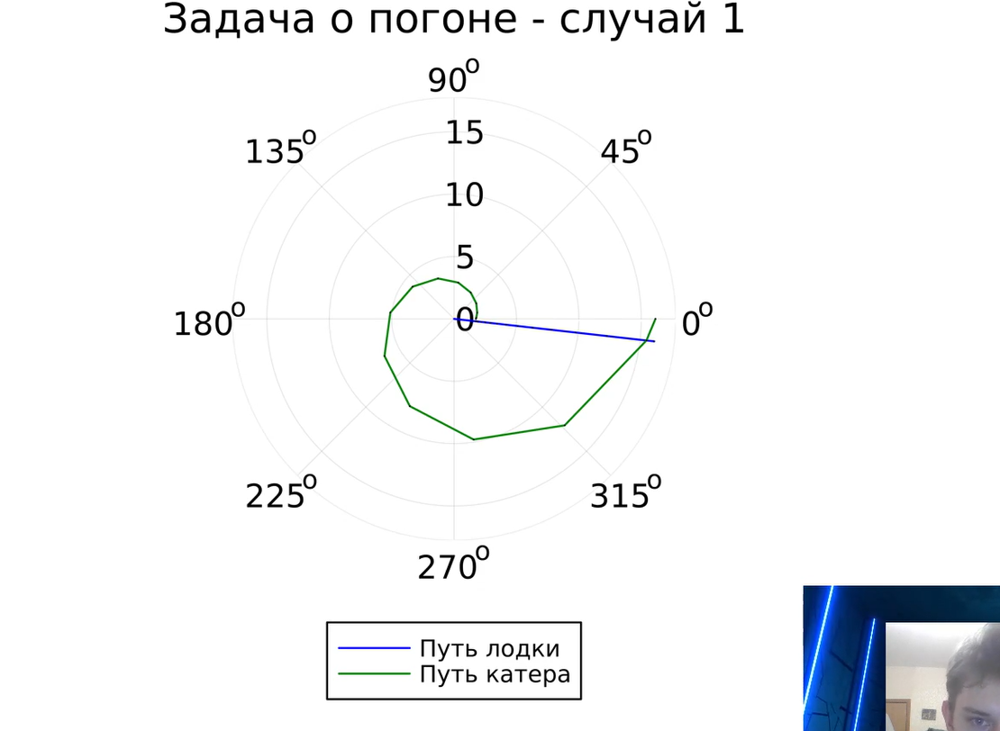 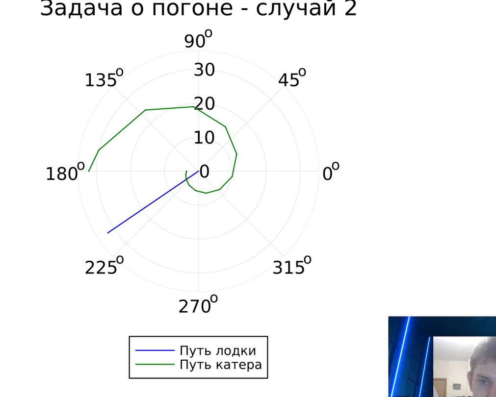 
По полученным изображениям вычислил точку пересечения катера и лодки.

# Выводы

Я ознакомился с языком Julia, его синтаксисом и научился решать задачи поиска с помощью построения математических моделей для выбора правильной стратегии.

# Список литературы{.unnumbered}

1. Документация по Julia: https://docs.julialang.org/en/v1/

2. Документация по OpenModelica: https://openmodelica.org/

3. Решение дифференциальных уравнений: https://www.wolframalpha.com/