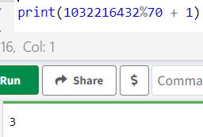
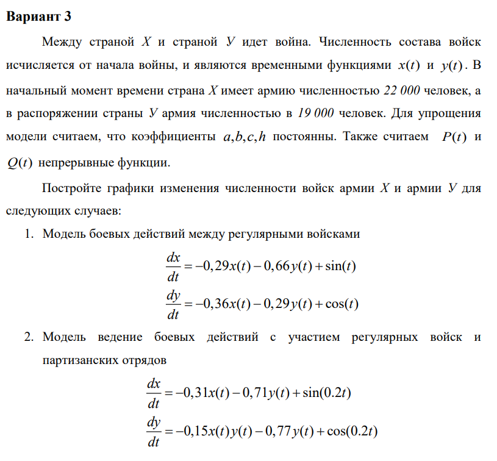
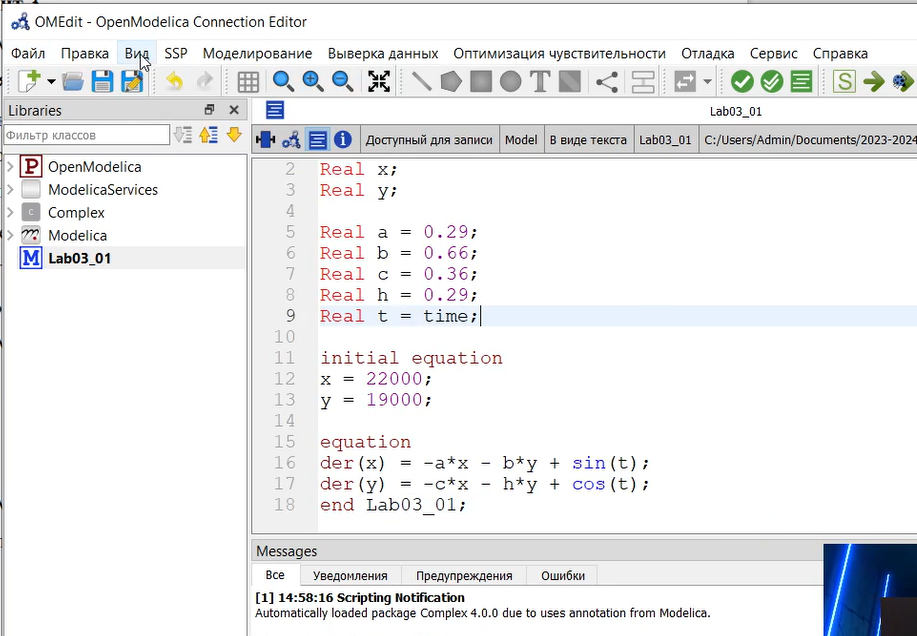
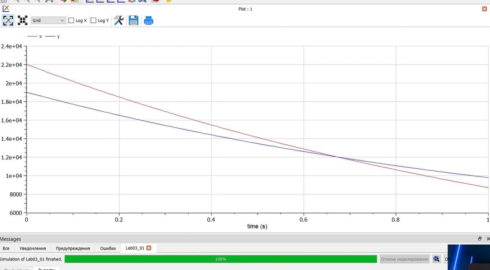
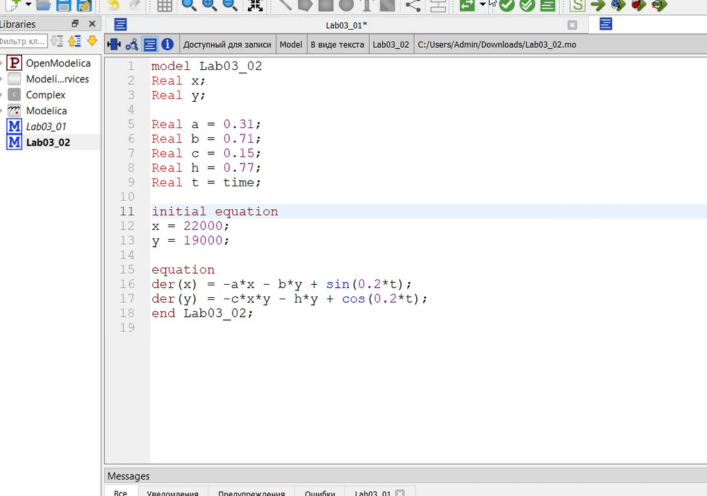
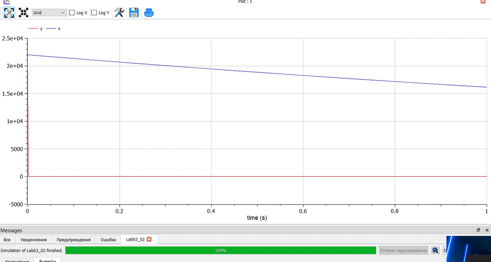
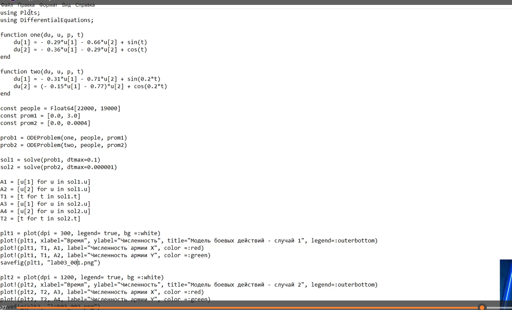
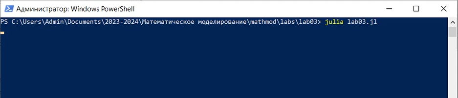
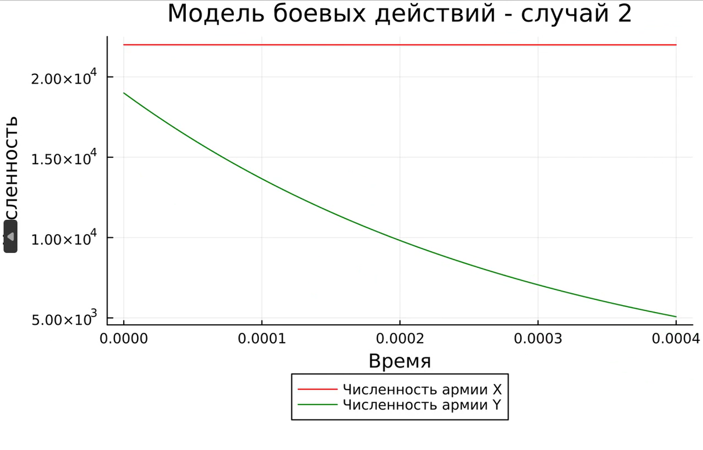

---
## Front matter
lang: ru-RU
title: Лабораторная работа №3
subtitle: Модель боевых действий
author:
  - Бабенко Артём Сергеевич, НФИбд-01-21, 1032216432
institute:
  - Российский университет дружбы народов, Москва, Россия
  
date: 22.02.2024

## i18n babel
babel-lang: russian
babel-otherlangs: english

## Formatting pdf
toc: false
toc-title: Содержание
slide_level: 2
aspectratio: 169
section-titles: true
theme: metropolis
header-includes:
 - \metroset{progressbar=frametitle,sectionpage=progressbar,numbering=fraction}
 - '\makeatletter'
 - '\beamer@ignorenonframefalse'
 - '\makeatother'
---

## Цель работы

Научиться решать задачи о ведении боевых действий.

---

## Теоретическое введение

Законы Ланчестера (законы Осипова — Ланчестера) — математическая формула для расчета относительных сил пары сражающихся сторон — подразделений вооруженных сил. В статье «Влияние численности сражающихся сторон на их потери», опубликованной журналом «Военный сборник» в 1915 году, генерал-майор Корпуса военных топографов М. П. Осипов описал математическую модель глобального вооружённого противостояния, практически применяемую в военном деле при описании убыли сражающихся сторон с течением времени и, входящую в математическую теорию исследования операций, на год опередив английского математика Ф. У. Ланчестера. Мировая война, две революции в России не позволили новой власти заявить в установленном в научной среде порядке об открытии царского офицера.

Уравнения Ланчестера — это дифференциальные уравнения, описывающие зависимость между силами сражающихся сторон A и D как функцию от времени, причем функция зависит только от A и D.

---

## Выполнение лабораторной работы

Рассчитал свой вариант по формуле: 

---

Установил OpenModellica и написал код для первого случая: 

---

Получил следующий результат: 

---

Написал код для второго случая: 

---

Получил следующий результат: 

---

Далее написал код на Julia: 

---

Запустил файл с кодом через Windows Powershell: 

Программа выдала следующие результаты:

Для первого случая: 

---

Для второго случая: 

Сравнив графики, полученные с помощью OpenModellica и Julia, можно увидеть, что они совпадают.

---

## Вывод

Я ознакомился с программой OpenModellica, её синтаксисом и научился решать задания о моделях боевых действий (моделях Ланчестера). Я построил по две модели на языках Julia и OpenModelica. В ходе проделанной работы можно сделать вывод, что построение моделей боевых действий на языке OpenModelica занимает гораздо меньше строк и времени, чем аналогичное построение на языке Julia.

---

## Список литературы

1) Документация по OpenModelica: https://openmodelica.org/

2) Решение дифференциальных уравнений: https://www.wolframalpha.com/

3) Законы Ланчестера: https://ru.wikipedia.org/wiki/%D0%97%D0%B0%D0%BA%D0%BE%D0%BD%D1%8B_%D0%9E%D1%81%D0%B8%D0%BF%D0%BE%D0%B2%D0%B0_%E2%80%94_%D0%9B%D0%B0%D0%BD%D1%87%D0%B5%D1%81%D1%82%D0%B5%D1%80%D0%B0

