---
## Front matter
lang: ru-RU
title: Лабораторная работа 4
subtitle: Модель гармонических колебаний
author:
  - Бабенко Артём Сергеевич, НФИбд-01-21, 1032216432
institute:
  - Российский университет дружбы народов, Москва, Россия
date: 27.02.2024

## i18n babel
babel-lang: russian
babel-otherlangs: english

## Formatting pdf
toc: false
toc-title: Содержание
slide_level: 2
aspectratio: 169
section-titles: true
theme: metropolis
header-includes:
 - \metroset{progressbar=frametitle,sectionpage=progressbar,numbering=fraction}
 - '\makeatletter'
 - '\beamer@ignorenonframefalse'
 - '\makeatother'
---

# Цель работы

Научиться строить фазовый портрет гармонического осциллятора и решать уравнения гармонического осциллятора для разных случаев.
---
# Теоретическое введение
## Гармонический осциллятор — система, которая при смещении из положения равновесия испытывает действие возвращающей силы F, пропорциональной смещению x.
## Гармоническое колебание - колебание, в процессе которого величины, характеризующие движение (смещение, скорость, ускорение и др.), изменяются по закону синуса или косинуса (гармоническому закону).
## Движение грузика на пружинке, маятника, заряда в электрическом контуре, а также эволюция во времени многих систем в физике, химии, биологии и других науках при определенных предположениях можно описать одним и тем же дифференциальным уравнением, которое в теории колебаний выступает в качестве основной модели. Эта модель называется линейным гармоническим осциллятором.
## Значение фазовых координат x, y в любой момент времени полностью определяет состояние системы. Решению уравнения движения как функции времени отвечает гладкая кривая в фазовой плоскости. Она называется фазовой траекторией. Если множество различных решений (соответствующих различным начальным условиям) изобразить на одной фазовой плоскости, возникает общая картина поведения системы. Такую картину, образованную набором фазовых траекторий, называют фазовым портретом.
---
# Выполнение лабораторной работы 

## 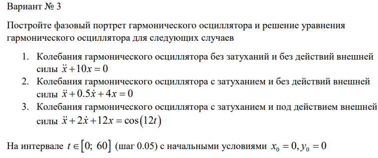
---

## Код на Julia для первого случая: 
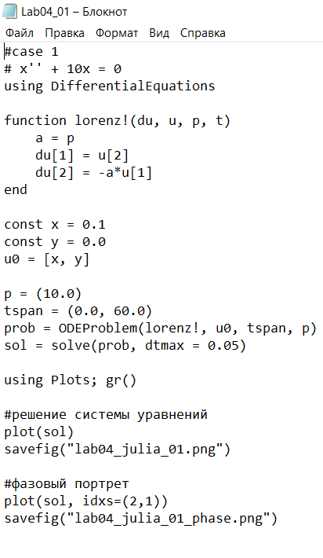
---
### Результаты:
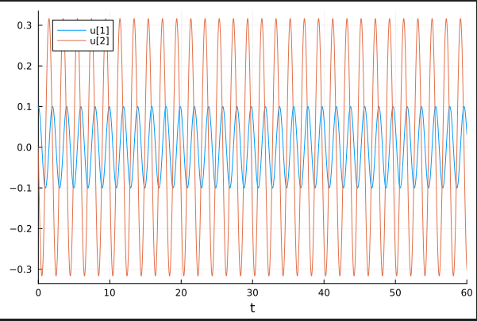 

---
## Код на Julia для второго случая: 
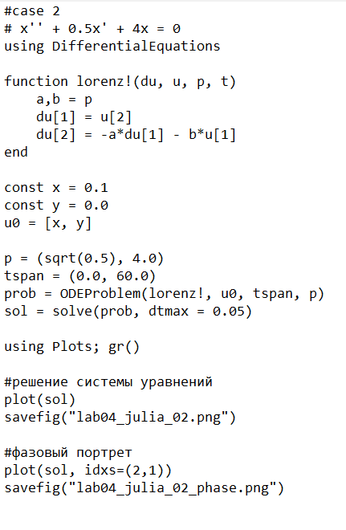
---
### Результаты:
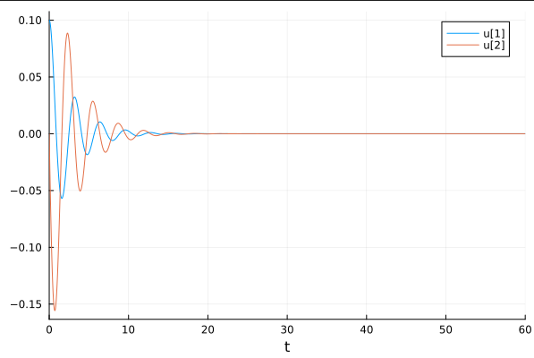 
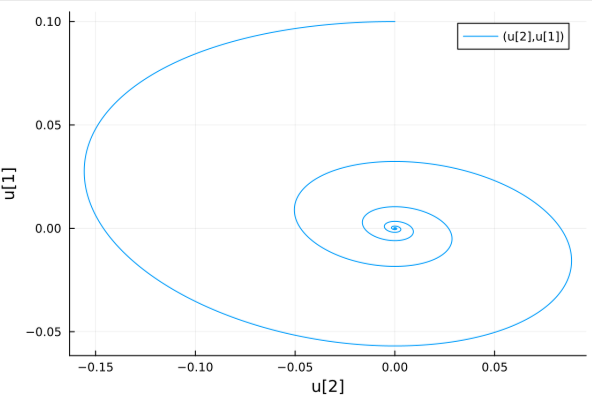
---

## Код на Julia для третьего случая: 
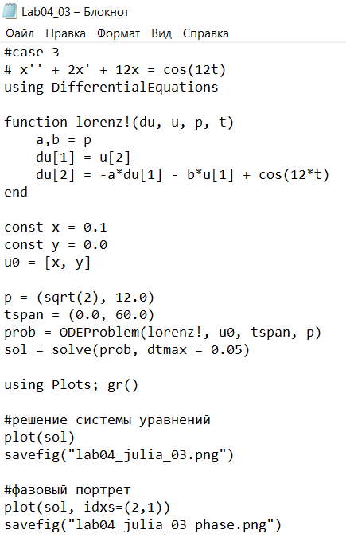
---
### Результаты:
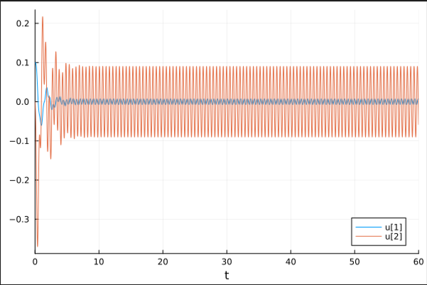 
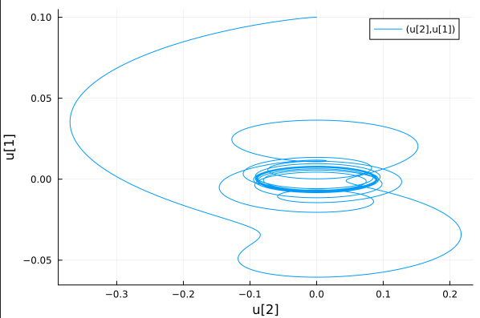
---

## Код для первого случая на OpenModelica:
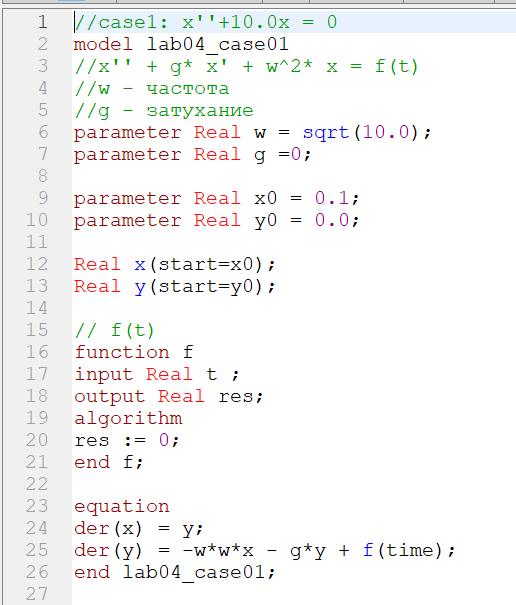
---
### Результат:
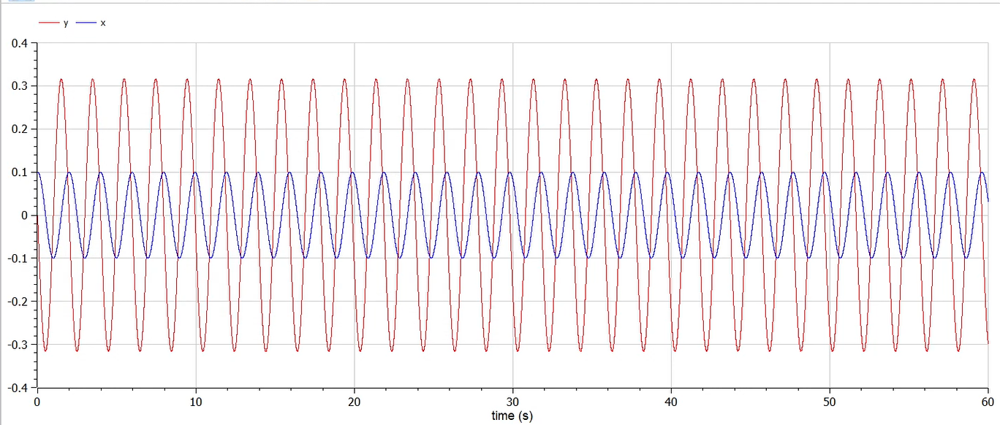 
---
## Код для второго случая:
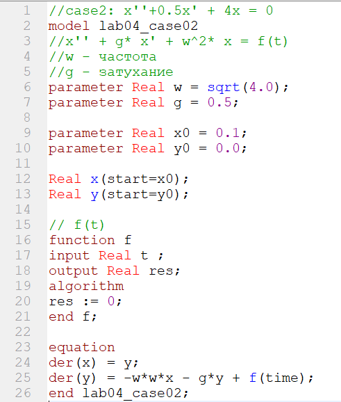
---
### Результат:
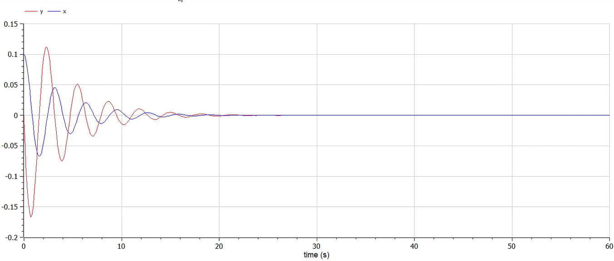 
---
## Код для третьего случая:
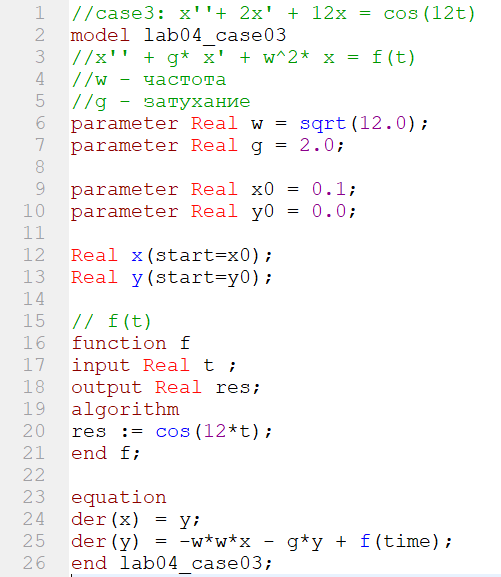
---
### Результат:
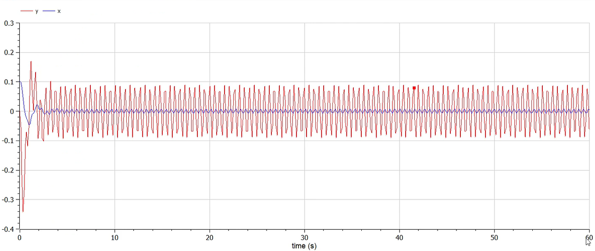 
---

# Вывод

Я научился строить фазовый портрет гармонического осциллятора и решать уравнения гармонического осциллятора для разных случаев с помощью Julia и OpenModelica.
---
# Список литературы

1. Документация по Julia: https://docs.julialang.org/en/v1/

2. Документация по OpenModelica: https://openmodelica.org/

3. Решение дифференциальных уравнений: https://www.wolframalpha.com/

4. Бутиков И. Е. Собственные колебания линейного осциллятора. 2011.
