---
## Front matter
title: "Лабораторная работа 4"
subtitle: "Модель гармонических колебаний"
author: "Бабенко Артём Сергеевич"

## Generic otions
lang: ru-RU
toc-title: "Содержание"

## Bibliography
bibliography: bib/cite.bib
csl: pandoc/csl/gost-r-7-0-5-2008-numeric.csl

## Pdf output format
toc: true # Table of contents
toc-depth: 2
lof: true # List of figures
lot: true # List of tables
fontsize: 12pt
linestretch: 1.5
papersize: a4
documentclass: scrreprt
## I18n polyglossia
polyglossia-lang:
  name: russian
  options:
	- spelling=modern
	- babelshorthands=true
polyglossia-otherlangs:
  name: english
## I18n babel
babel-lang: russian
babel-otherlangs: english
## Fonts
mainfont: PT Serif
romanfont: PT Serif
sansfont: PT Sans
monofont: PT Mono
mainfontoptions: Ligatures=TeX
romanfontoptions: Ligatures=TeX
sansfontoptions: Ligatures=TeX,Scale=MatchLowercase
monofontoptions: Scale=MatchLowercase,Scale=0.9
## Biblatex
biblatex: true
biblio-style: "gost-numeric"
biblatexoptions:
  - parentracker=true
  - backend=biber
  - hyperref=auto
  - language=auto
  - autolang=other*
  - citestyle=gost-numeric
## Pandoc-crossref LaTeX customization
figureTitle: "Рис."
tableTitle: "Таблица"
listingTitle: "Листинг"
lofTitle: "Список иллюстраций"
lotTitle: "Список таблиц"
lolTitle: "Листинги"
## Misc options
indent: true
header-includes:
  - \usepackage{indentfirst}
  - \usepackage{float} # keep figures where there are in the text
  - \floatplacement{figure}{H} # keep figures where there are in the text
---

# Цель работы

Научиться строить фазовый портрет гармонического осциллятора и решать уравнения гармонического осциллятора для разных случаев.

# Теоретическое введение

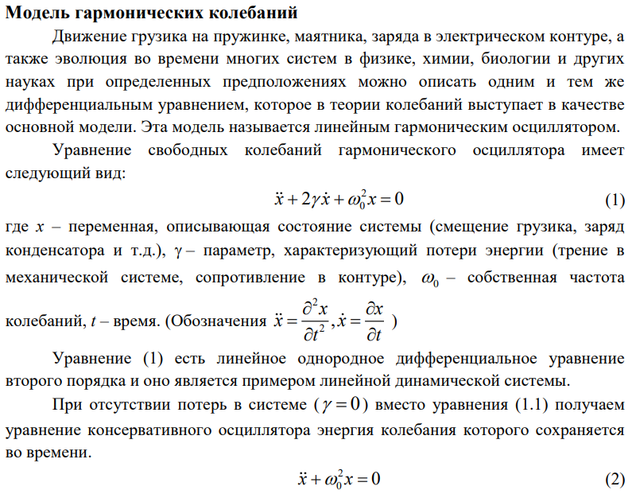

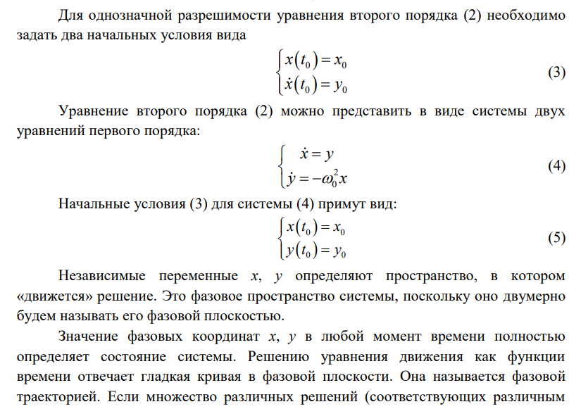

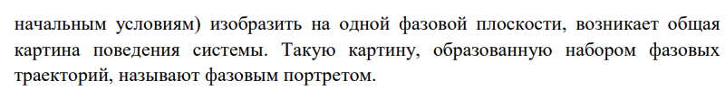

# Выполнение лабораторной работы

Рассчитал вариант по формуле: 
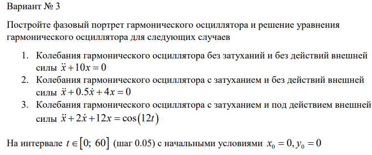

Написал код на Julia для первого случая: 
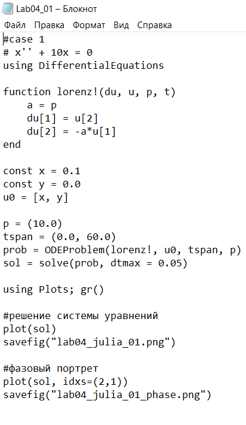

Программа выдала следующие результаты:
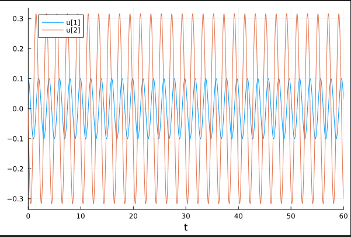 

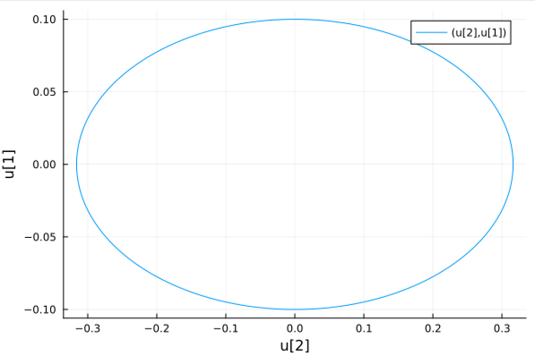

Написал код на Julia для второго случая: 
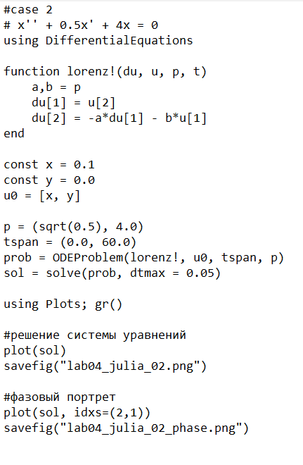

Программа выдала следующие результаты:
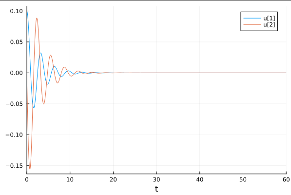 

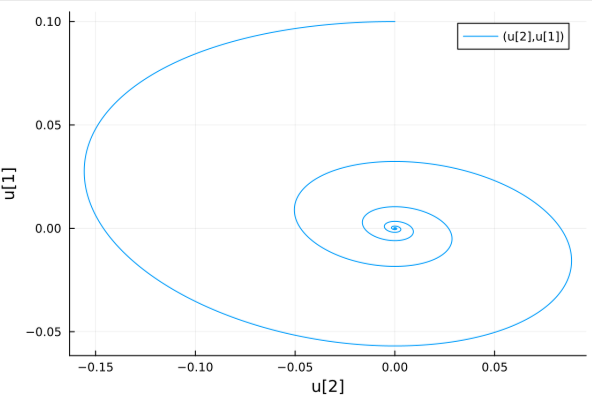

Написал код на Julia для третьего случая: 
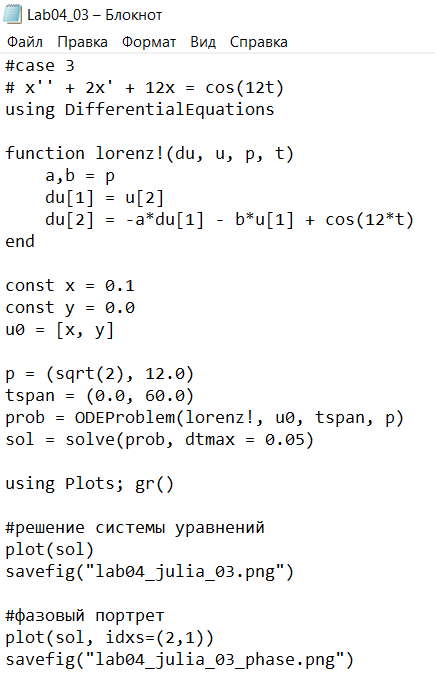

Программа выдала следующие результаты:
 

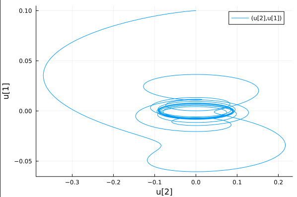

Далее написал код для первого случая и запустил его через OpenModelica:
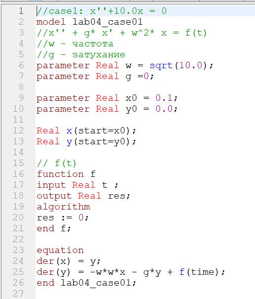

Программа выдала следующий результат:
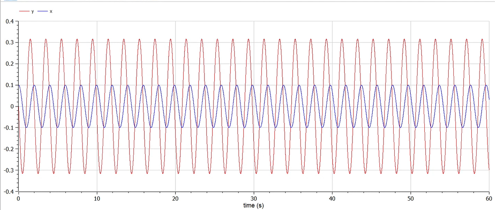 

Написал код для второго случая:
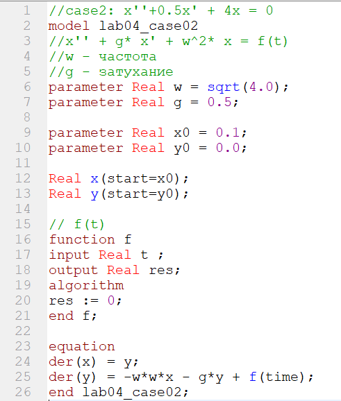

Программа выдала следующий результат:
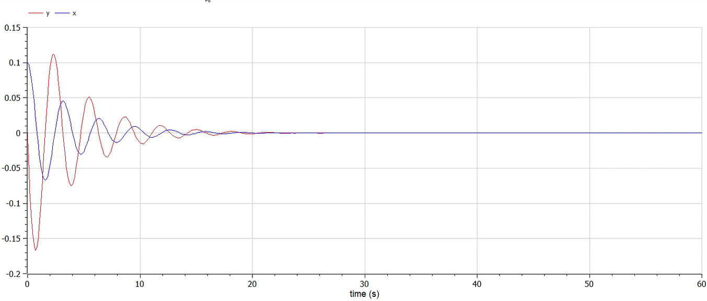 

Написал код для третьего случая:
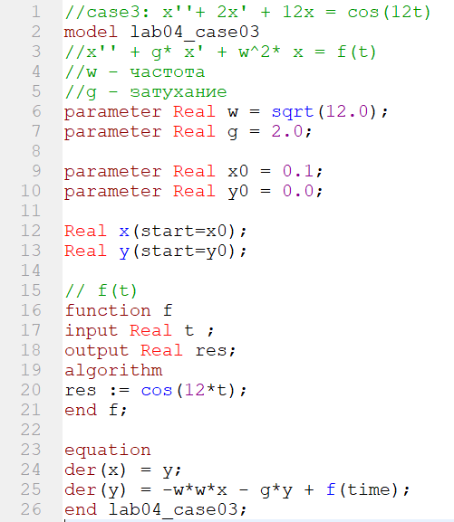

Программа выдала следующий результат:
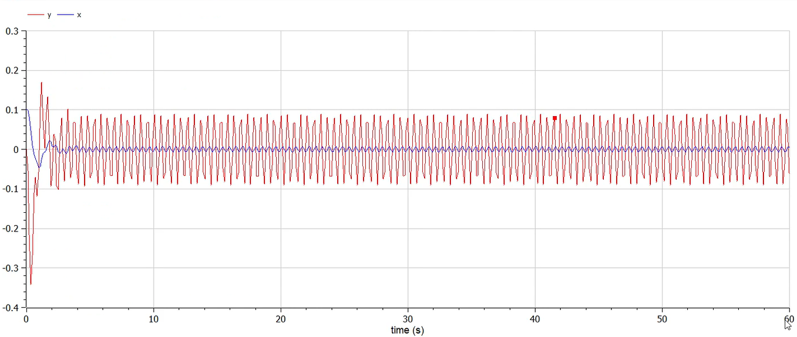 

# Выводы

Я научился строить фазовый портрет гармонического осциллятора и решать уравнения гармонического осциллятора для разных случаев с помощью Julia и OpenModelica.

# Список литературы{.unnumbered}

1. Документация по Julia: https://docs.julialang.org/en/v1/

2. Документация по OpenModelica: https://openmodelica.org/

3. Решение дифференциальных уравнений: https://www.wolframalpha.com/

4. Бутиков И. Е. Собственные колебания линейного осциллятора. 2011.