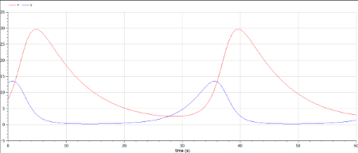

# Лабораторная работа №5

## Модель хищник-жертва

Выполнил: Бабенко Артём Сергеевич, НФИбд-01-21

---

# Цель работы:
Научиться строить график зависимости численности хищников от численности жертв, график изменения численности хищников и численности жертв при 
различных начальных условиях. Научиться находить стационарное состояние системы.

---

# Теоретическое введение

Простейшая модель взаимодействия двух видов типа «хищник — жертва» -
модель Лотки-Вольтерры. Данная двувидовая модель основывается на 
следующих предположениях:
1. Численность популяции жертв x и хищников y зависят только от времени 
(модель не учитывает пространственное распределение популяции на 
занимаемой территории)
2. В отсутствии взаимодействия численность видов изменяется по модели 
Мальтуса, при этом число жертв увеличивается, а число хищников падает
3. Естественная смертность жертвы и естественная рождаемость хищника 
считаются несущественными
4. Эффект насыщения численности обеих популяций не учитывается
5. Скорость роста численности жертв уменьшается пропорционально 
численности хищников.

---
# Теоретическое введение

Стационарное состояние системы (1) (положение равновесия, не зависящее 
от времени решение) будет в точке: x0 = c/d, y0 = a/b.
Если начальные значения задать в стационарном состоянии x(0)=x0, y(0)=y0, то в любой момент времени численность популяций изменяться не будет. При малом отклонении от положения равновесия численности как хищника, так и жертвы с течением времени не возвращаются к равновесным значениям, а совершают периодические колебания вокруг стационарной точки. 

---

# Выполнение лабораторной работы

Задание звучит следующим образом:
 

---

# Выполнение лабораторной работы

Код на Julia: 

---

# Выполнение лабораторной работы

Программа выдала следующие результаты:
график зависимости численности хищников от численности жертв:
 
график изменения численности хищников и численности жертв при заданных начальных условиях:

---

# Выполнение лабораторной работы

Код для определения стационарного состояния системы:
     график:

---

# Выполнение лабораторной работы

Код на OpenModelica: 

Программа выдала следующие результаты:
график зависимости численности хищников от численности жертв:
 

---

# Выполнение лабораторной работы

график изменения численности хищников и численности жертв при заданных начальных условиях:

стационарное состояние системы:

---
# Вывод

Я научился строить график зависимости численности хищников от численности жертв, график изменения численности хищников и численности жертв при 
различных начальных условиях. Научился находить стационарное 
состояние системы.
