# Лабораторная работа №6

## Задача об эпидемии

Выполнил: Бабенко Артём Сергеевич, НФИбд-01-21

---

# Цель работы:
Изучить понятие задачи об эпидемии, научиться строить графики изменения числа особей в каждой из групп.

---

# Теоретическое введение

Простейшая модель эпидемии: Предположим, что некая 
популяция, состоящая из N особей, (считаем, что популяция изолирована) 
подразделяется на три группы. Первая группа - это восприимчивые к болезни, но пока здоровые особи, обозначим их через S(t). Вторая группа – это число 
инфицированных особей, которые также при этом являются распространителями 
инфекции, обозначим их I(t). А третья группа, обозначающаяся через R(t) – это здоровые особи с иммунитетом к болезни. 
До того, как число заболевших не превышает критического значения 
I*, считаем, что все больные изолированы и не заражают здоровых. Когда 
I(t) > I* , тогда инфицирование способны заражать восприимчивых к болезни особей. 

---

# Теоретическое введение

Поскольку каждая восприимчивая к болезни особь, которая, в конце концов, 
заболевает, сама становится инфекционной, то скорость изменения числа 
инфекционных особей представляет разность за единицу времени между 
заразившимися и теми, кто уже болеет и лечится.

---

# Выполнение лабораторной работы

Задание:
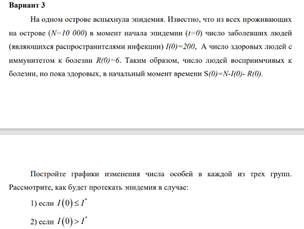 

---

# Выполнение лабораторной работы

Код на Julia для первого случая: 
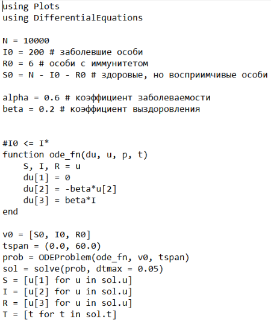 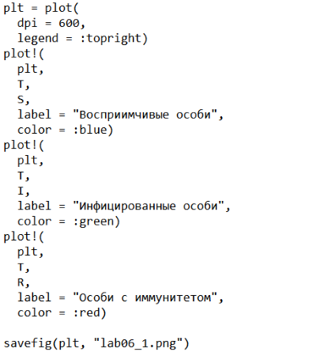

---

# Выполнение лабораторной работы

Результат:
График изменения числа особей в каждой из групп:
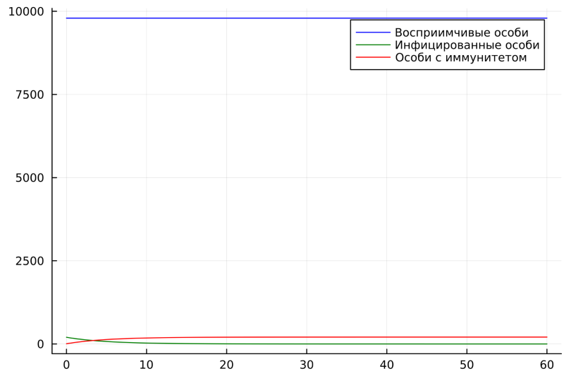 

---

# Выполнение лабораторной работы
Код на Julia для второго случая: 
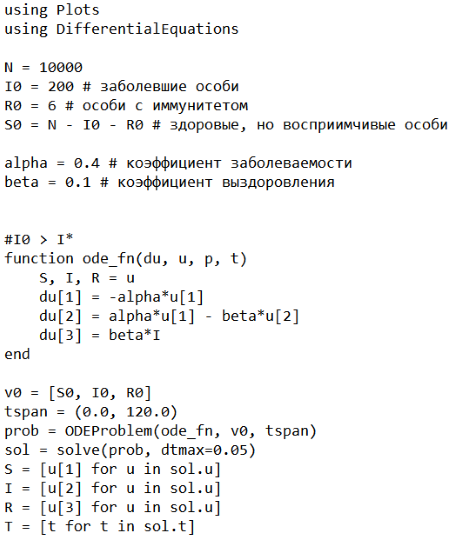 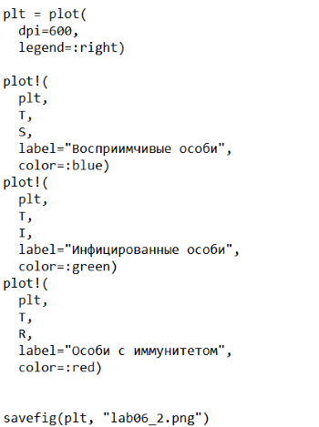

---

# Выполнение лабораторной работы
Результат:
График изменения числа особей в каждой из групп:
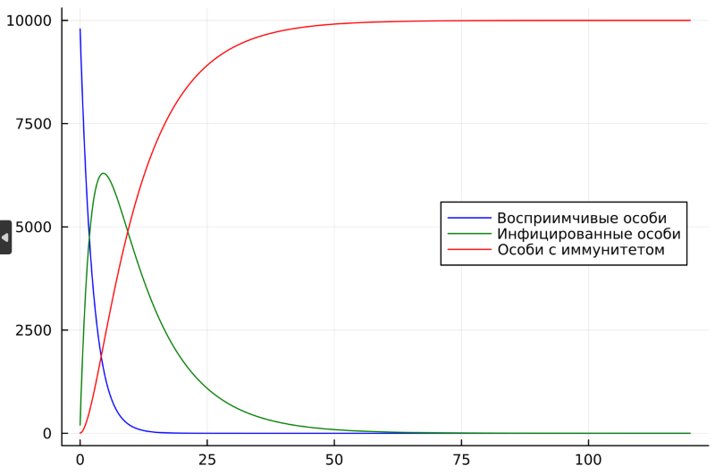 

---

# Выполнение лабораторной работы
Код на OpenModelica для первого случая: 
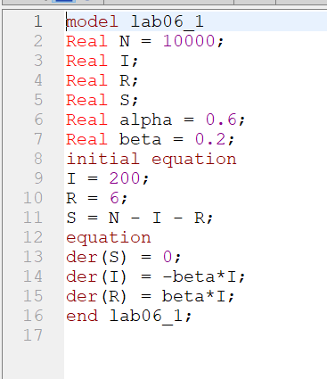

---

# Выполнение лабораторной работы
Результат:
График изменения числа особей в каждой из групп:
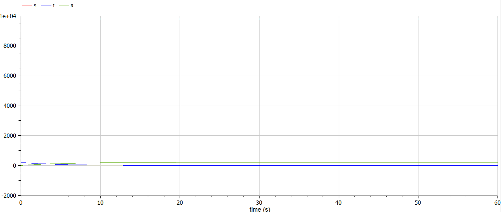 

---

# Выполнение лабораторной работы
Код на OpenModelica для второго случая: 
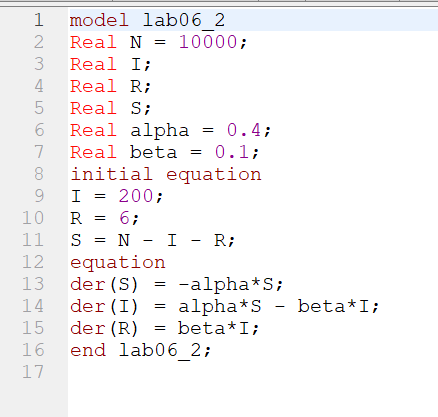

---

# Выполнение лабораторной работы
Результат:
График изменения числа особей в каждой из групп:
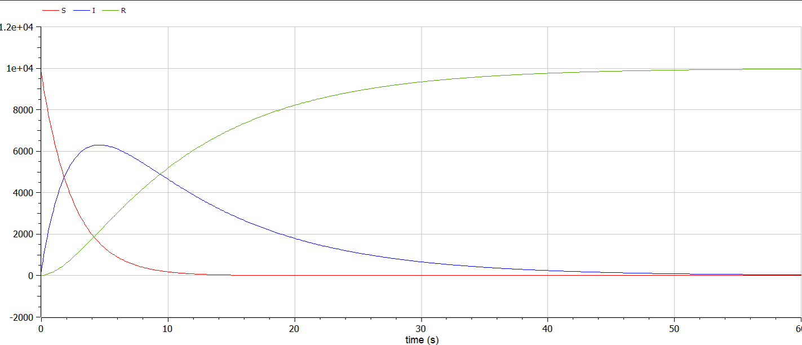 

---

# Вывод

Я изучил понятие задачи об эпидемии, научился строить графики изменения числа особей в каждой из групп.