---
## Front matter
title: "Лабораторная работа 6"
subtitle: "Задача об эпидемии"
author: "Бабенко Артём Сергеевич"

## Generic otions
lang: ru-RU
toc-title: "Содержание"

## Bibliography
bibliography: bib/cite.bib
csl: pandoc/csl/gost-r-7-0-5-2008-numeric.csl

## Pdf output format
toc: true # Table of contents
toc-depth: 2
lof: true # List of figures
lot: true # List of tables
fontsize: 12pt
linestretch: 1.5
papersize: a4
documentclass: scrreprt
## I18n polyglossia
polyglossia-lang:
  name: russian
  options:
	- spelling=modern
	- babelshorthands=true
polyglossia-otherlangs:
  name: english
## I18n babel
babel-lang: russian
babel-otherlangs: english
## Fonts
mainfont: PT Serif
romanfont: PT Serif
sansfont: PT Sans
monofont: PT Mono
mainfontoptions: Ligatures=TeX
romanfontoptions: Ligatures=TeX
sansfontoptions: Ligatures=TeX,Scale=MatchLowercase
monofontoptions: Scale=MatchLowercase,Scale=0.9
## Biblatex
biblatex: true
biblio-style: "gost-numeric"
biblatexoptions:
  - parentracker=true
  - backend=biber
  - hyperref=auto
  - language=auto
  - autolang=other*
  - citestyle=gost-numeric
## Pandoc-crossref LaTeX customization
figureTitle: "Рис."
tableTitle: "Таблица"
listingTitle: "Листинг"
lofTitle: "Список иллюстраций"
lotTitle: "Список таблиц"
lolTitle: "Листинги"
## Misc options
indent: true
header-includes:
  - \usepackage{indentfirst}
  - \usepackage{float} # keep figures where there are in the text
  - \floatplacement{figure}{H} # keep figures where there are in the text
---

# Цель работы

Изучить понятие задачи об эпидемии, научиться строить графики изменения числа особей в каждой из групп.

# Теоретическое введение

Простейшая модель эпидемии: Предположим, что некая 
популяция, состоящая из N особей, (считаем, что популяция изолирована) 
подразделяется на три группы. Первая группа - это восприимчивые к болезни, но пока здоровые особи, обозначим их через S(t). Вторая группа – это число 
инфицированных особей, которые также при этом являются распространителями 
инфекции, обозначим их I(t). А третья группа, обозначающаяся через R(t) – это здоровые особи с иммунитетом к болезни. 
До того, как число заболевших не превышает критического значения 
I*, считаем, что все больные изолированы и не заражают здоровых. Когда 
I(t) > I* , тогда инфицирование способны заражать восприимчивых к болезни особей. 
Поскольку каждая восприимчивая к болезни особь, которая, в конце концов, 
заболевает, сама становится инфекционной, то скорость изменения числа 
инфекционных особей представляет разность за единицу времени между 
заразившимися и теми, кто уже болеет и лечится.

# Выполнение лабораторной работы

Задание звучит следующим образом:
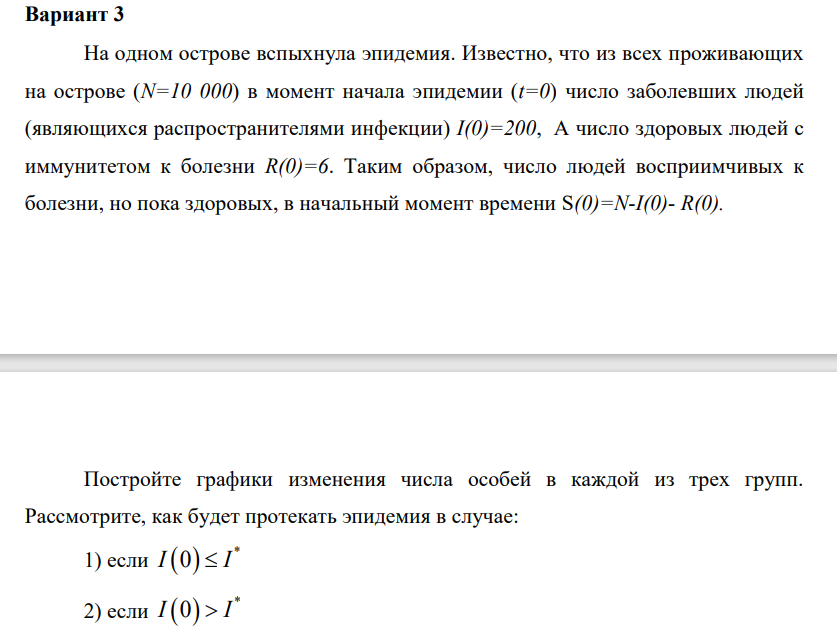 

Написал код на Julia для первого случая: 
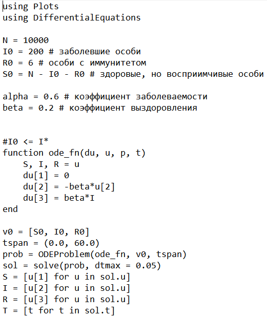
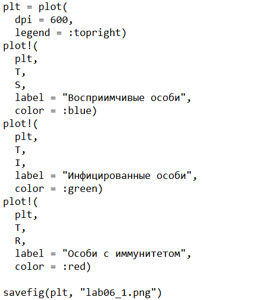

Программа выдала следующие результаты:
График изменения числа особей в каждой из групп:
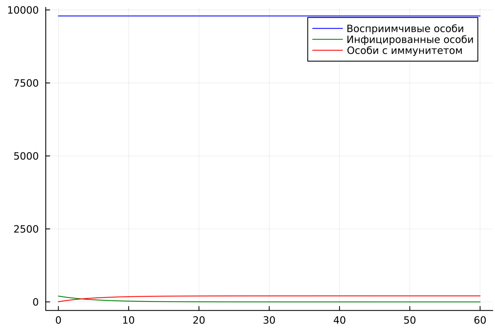 

Написал код на Julia для второго случая: 
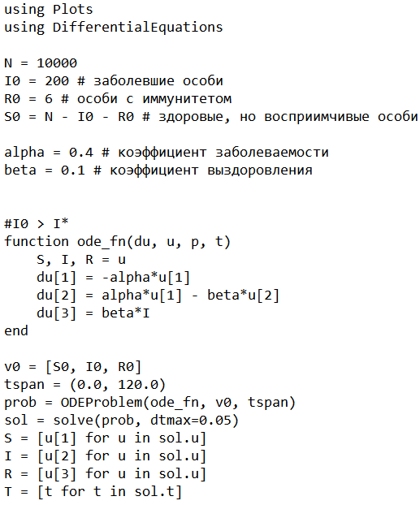
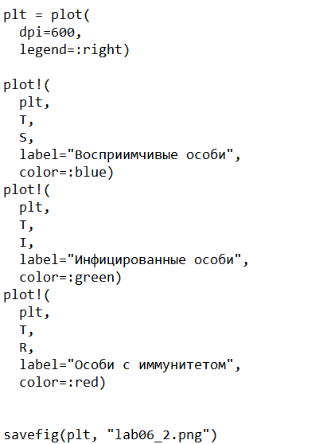

Программа выдала следующие результаты:
График изменения числа особей в каждой из групп:
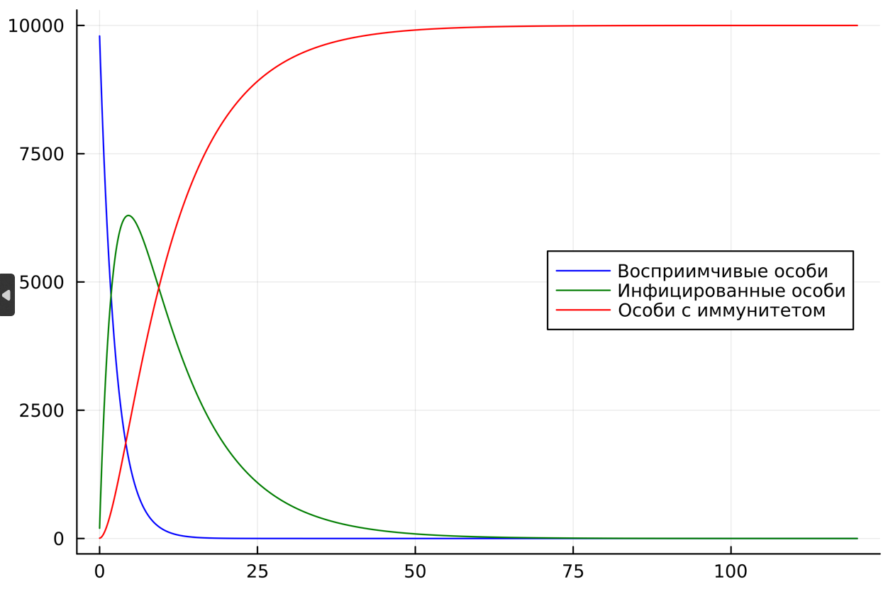 

Написал код на OpenModelica для первого случая: 
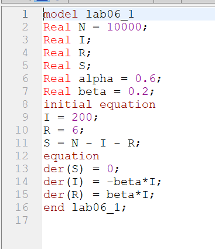

Программа выдала следующие результаты:
График изменения числа особей в каждой из групп:
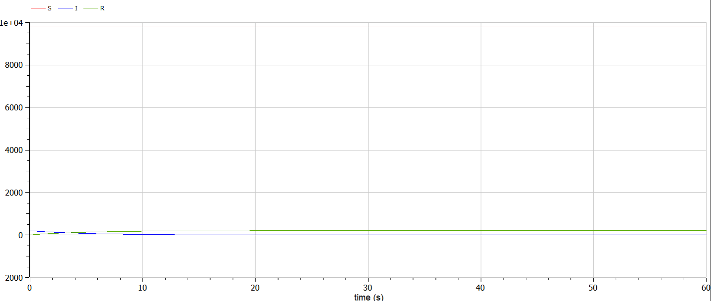 

Написал код на OpenModelica для второго случая: 
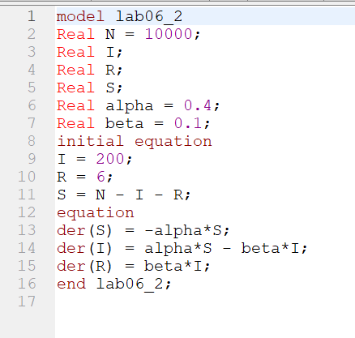

Программа выдала следующие результаты:
График изменения числа особей в каждой из групп:
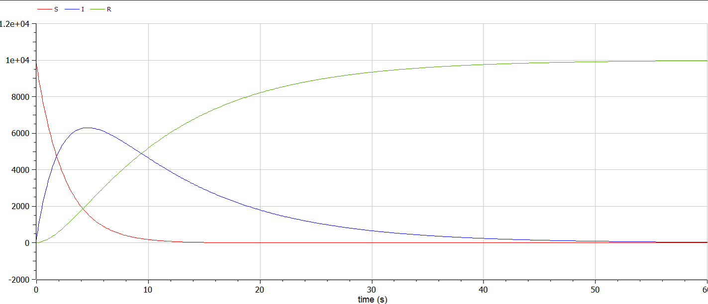 

# Вывод

Я изучил понятие задачи об эпидемии, научился строить графики изменения числа особей в каждой из групп.

# Список литературы{.unnumbered}

1. Документация по Julia: https://docs.julialang.org/en/v1/

2. Документация по OpenModelica: https://openmodelica.org/

3. Решение дифференциальных уравнений: https://www.wolframalpha.com/

4. Бутиков И. Е. Собственные колебания линейного осциллятора. 2011.