# Лабораторная работа №7

## Эффективность рекламы

Выполнил: Бабенко Артём Сергеевич, НФИбд-01-21

---

# Цель работы:
Ознакомиться с темой "Эффективность рекламы", построить графики распространения рекламы, математические модели которой описываются 
различными уравнениями.

---

# Теоретическое введение

Организуется рекламная кампания нового товара или услуги. Необходимо, чтобы прибыль будущих продаж с избытком покрывала издержки на рекламу. Вначале расходы могут превышать прибыль, поскольку лишь малая часть потенциальных покупателей будет информирована о новинке. Затем, при увеличении числа продаж, возрастает и прибыль, и, наконец, наступит момент, когда рынок насытиться, и рекламировать товар станет бесполезным.

---

# Теоретическое введение

Предположим, что торговыми учреждениями реализуется некоторая продукция, о которой в момент времени t из числа потенциальных покупателей N знает лишь n
 покупателей. Для ускорения сбыта продукции запускается реклама по радио, телевидению и других средств массовой информации. После запуска рекламной кампании информация о продукции начнет распространяться среди потенциальных покупателей путем общения друг с другом. Таким образом, после запуска рекламных объявлений скорость изменения числа знающих о продукции людей пропорциональна как числу знающих о товаре покупателей, так и числу покупателей о нем не знающих.

 ---

 # Выполнение лабораторной работы

Задание звучит следующим образом:
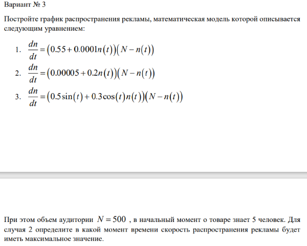 

 ---

 # Выполнение лабораторной работы

Код на Julia для первого случая: 
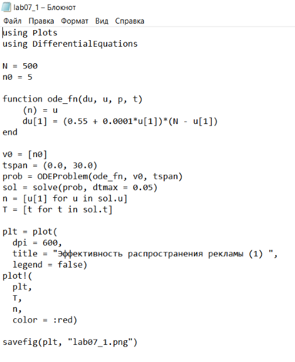

 ---

 # Выполнение лабораторной работы
Результат:
График распространения рекламы:
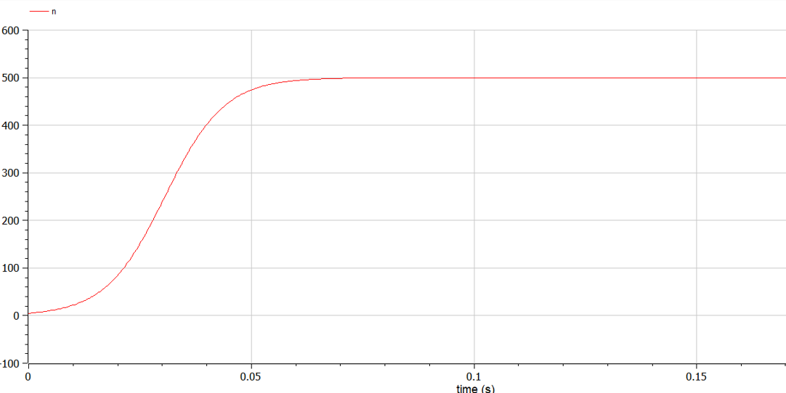 

 ---

 # Выполнение лабораторной работы
Код на Julia для второго случая: 
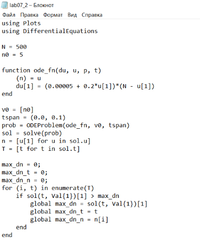 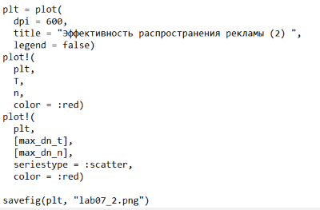

 ---

 # Выполнение лабораторной работы
Результат:
График распространения рекламы:
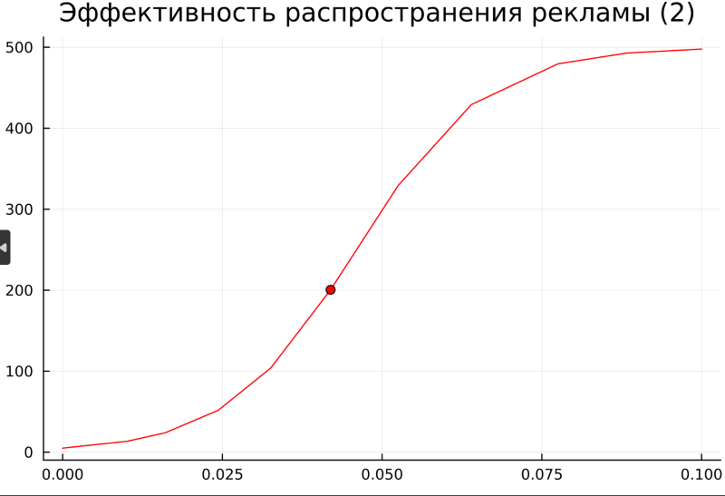 

 ---

 # Выполнение лабораторной работы
Код на Julia для третьего случая: 
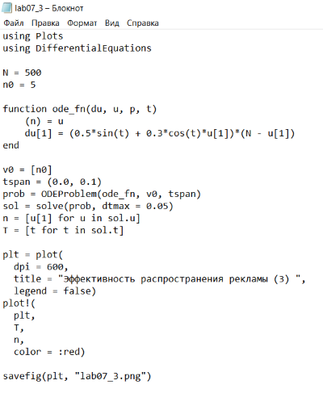

 ---

 # Выполнение лабораторной работы
Результат:
График распространения рекламы:
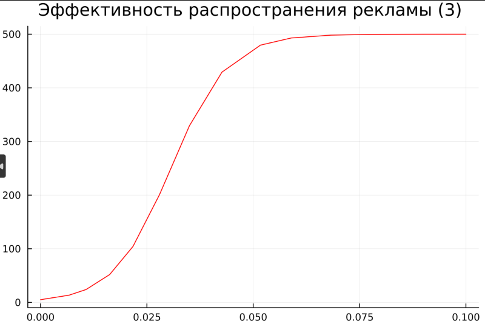 

 ---

 # Выполнение лабораторной работы
Код на OpenModelica для первого случая: 
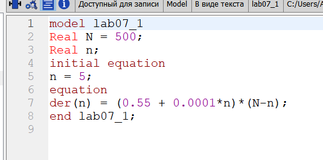

 ---

 # Выполнение лабораторной работы
Результат:
График распространения рекламы:
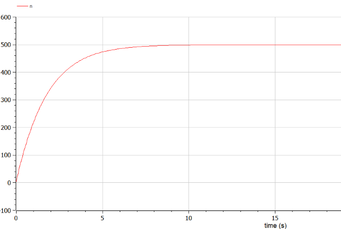 

 ---

 # Выполнение лабораторной работы
Код на OpenModelica для второго случая: 
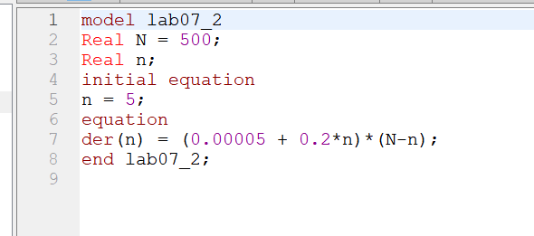

 ---

 # Выполнение лабораторной работы
Результат:
График распространения рекламы:
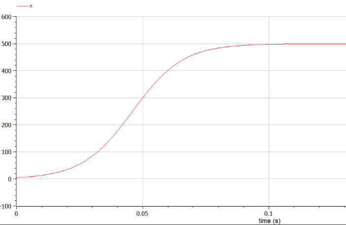 

 ---

 # Выполнение лабораторной работы
Код на OpenModelica для третьего случая: 
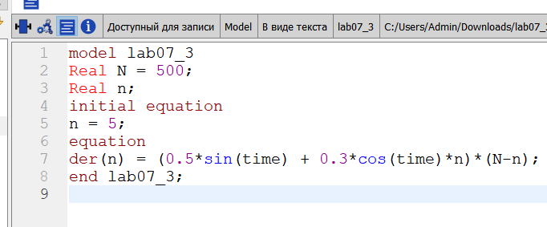

 ---

 # Выполнение лабораторной работы
Результат:
График распространения рекламы:
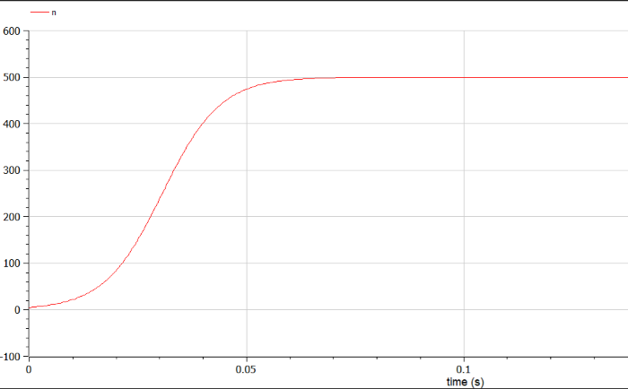 

---

# Вывод

Я ознакомился с темой "Эффективность рекламы", построил графики распространения рекламы, математические модели которой описываются 
различными уравнениями.