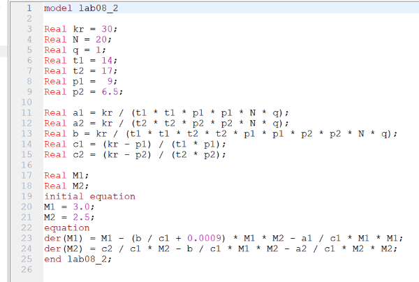

# Лабораторная работа №8

## Модель конкуренции двух фирм

Выполнил: Бабенко Артём Сергеевич, НФИбд-01-21

---

# Цель работы:
Рассмотреть модели конкуренции двух фирм, научиться строить графики изменения оборотных фирм без учета постоянных издержек и с веденной нормировкой.

---

# Теоретическое введение

 

---

# Теоретическое введение
 

---

# Выполнение лабораторной работы

Задание:
 

---

# Выполнение лабораторной работы

Код на Julia для первого случая: 

---

# Выполнение лабораторной работы

Результат:
График изменения оборотных фирм без учета постоянных издержек и с веденной нормировкой:
 
Каждая фирма достигает свое максимальное значение объема продаж и остается на рынке с этим значением, то есть каждая фирма захватывает свою часть рынка потребителей, которая не изменяется.

---

# Выполнение лабораторной работы

Код на Julia для второго случая: 

---

# Выполнение лабораторной работы

Результат:
График изменения оборотных фирм без учета постоянных издержек и с веденной нормировкой:
 
По графику видно, что первая фирма, несмотря на начальный рост, достигнув своего максимального объема продаж, начитает нести убытки и, в итоге, терпит банкротство. Динамика роста объемов оборотных средств второй фирмы остается без изменения: достигнув максимального значения, остается на этом уровне.

---

# Выполнение лабораторной работы

Код на OpenModelica для первого случая: 

---

# Выполнение лабораторной работы

Результат:
График изменения оборотных фирм без учета постоянных издержек и с веденной нормировкой:
 

---

# Выполнение лабораторной работы

Код на OpenModelica для второго случая: 

---

# Выполнение лабораторной работы

Результат:
График изменения оборотных фирм без учета постоянных издержек и с веденной нормировкой:
 

--- 

# Вывод

Я рассмотрел модели конкуренции двух фирм, научился строить графики изменения оборотных фирм без учета постоянных издержек и с веденной нормировкой.